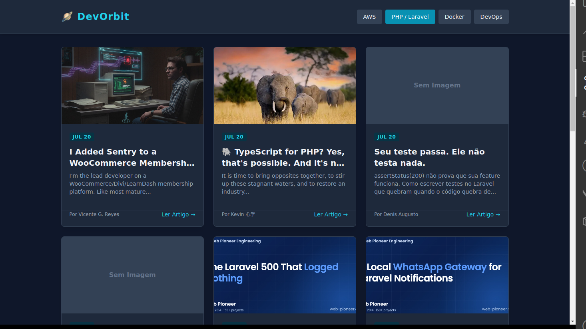
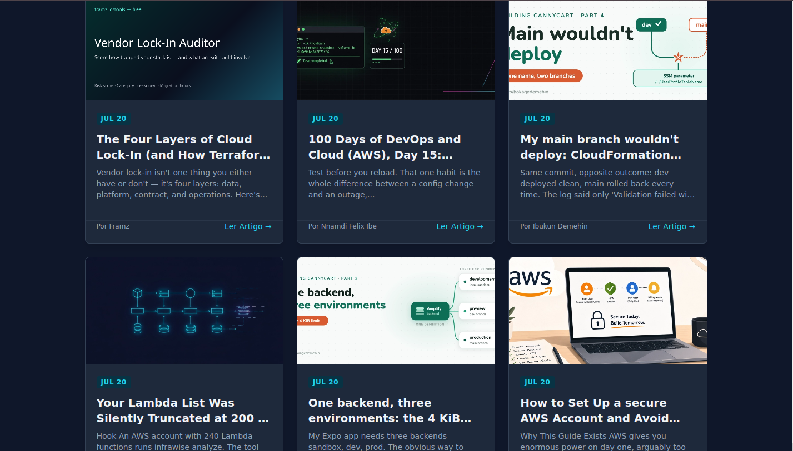

# 🪐 DevOrbit

> *Ranging the tech universe to capture the best content from your favorite stacks.*

**DevOrbit** é um agregador de feeds de tecnologia moderno e minimalista. Desenvolvido para centralizar o conhecimento essencial sobre engenharia de software, ele consome APIs em tempo real para entregar artigos filtrados por categorias vitais para o ecossistema moderno — como Cloud Computing, PHP/Laravel, Docker e DevOps.

Mais do que um simples leitor de notícias, este projeto serve como base prática para explorar arquitetura de nuvem, conteinerização e infraestrutura como código (IaC).

---

## 🚀 Tecnologias Envolvidas

* **Backend:** PHP 8.x, Laravel (HTTP Client & Blade)
* **Frontend:** Tailwind CSS (UI moderna e responsiva)
* **Integração:** RESTful API (Dev.to / Forem)
* **Infraestrutura & Nuvem (Em breve):** Docker, Linux, AWS (EC2/S3) & Terraform

---

## ✨ Funcionalidades

* 🔍 **Consumo Dinâmico de API:** Requisições assíncronas e tratadas direto com o ecossistema Laravel.
* 🏷️ **Filtros por Órbitas (Tags):** Alterne instantaneamente entre AWS, PHP, Docker, DevOps e muito mais.
* 📱 **Design Responsivo:** Interface limpa inspirada em painéis de monitoramento espacial.


## 📸 Visualização do Projeto

<p align="center">
  
  
</p>


## 💻 Como Rodar o Projeto com Docker (Desenvolvimento)

Para testar o DevOrbit na sua máquina de forma isolada e com sincronização de código em tempo real (*live reload*), siga os passos abaixo:

### Pré-requisitos
* Ter o [Docker](https://www.docker.com/) e o [Docker Compose](https://docs.docker.com/compose/) instalados na sua máquina.

### Passo a Passo

1. **Clone o repositório:**
   ```bash
   git clone [https://github.com/AlanPires01/dev-orbit.git](https://github.com/AlanPires01/dev-orbit.git)
   cd dev-orbit

2. **Configure o arquivo de ambiente:**
* Duplique o arquivo de exemplo do Laravel para criar o seu .env local:
  ```bash
      cp .env.example .env
3. **Suba o ambiente com o Docker Compose:**
* Execute o comando abaixo para construir a imagem de desenvolvimento e subir o container:
  ```bash
      docker compose up --build
4. **Acesse no navegador**
* Abra o seu navegador e acesse:

    http://localhost:8000
5. **Para parar a aplicação:**
* No terminal onde o container está rodando, pressione Ctrl + C, ou digite em outro terminal na pasta do projeto:
  ```bash
      docker compose down
